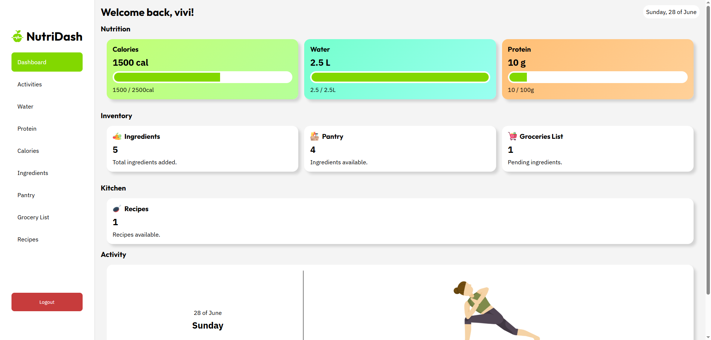

# NutriDash

NutriDash is a personal nutrition and kitchen management dashboard built with Vue and TypeScript. It combines nutrition tracking, pantry management, grocery planning, recipe organization, and activity tracking into a single application.

Rather than focusing only on calorie counting, NutriDash aims to simplify everyday food management by helping users keep track of what they eat, what ingredients they already own, what they need to buy, and what they plan to cook.

🔗 Live Demo  
[Visit the website](https://vivi4na02l.github.io/health-dashboard/)

## Preview

## Features

### Dashboard
* Daily nutrition overview
* Protein, calories, and water progress
* Pantry summary
* Grocery list overview
* Planned activities
* Configurable dashboard widgets [under development]

### Nutrition Tracking
* Daily protein, calorie, and water goals
* Support for cutting and bulking calorie targets [under development]
* Daily history and progress tracking [under development]

### Ingredients
* Create reusable ingredients
* Store nutritional information per 100g
* Organize ingredients into categories
* Reuse ingredients across pantry, recipes, grocery lists, and nutrition tracking

### Pantry
* Inventory management
* Ingredient search
* Multiple sorting and filtering options
* Stock availability tracking
* Quick transfer to grocery list

### Grocery List
* Shopping progress tracking
* Adjustable quantities
* Purchased / pending status
* Optional purchase cost logging for statistics [under development]

### Recipes [under development]
* Save custom recipes
* Store ingredients and quantities 
* Step-by-step preparation instructions
* Optional recipe image
* Automatic nutrition calculation
* Automatically remove used ingredients from pantry when cooking

### Activities
* Daily activity planner
* Streak tracking [under development]

### Statistics [under development]
* Protein consumption
* Water intake
* Calorie history
* Grocery expenses

## Tech Stack
* Vue
* TypeScript and JavaScript
* CSS

## Architecture
One of the primary goals of NutriDash was to design a coherent data model capable of supporting multiple interconnected features.

Rather than treating each module independently, the application revolves around reusable entities such as ingredients and recipes. These entities are shared across nutrition tracking, pantry management, grocery lists, meal planning, and recipes, requiring consistent relationships and synchronized state throughout the application.

As a result, the project places a stronger emphasis on application logic, data modeling, and state management than on visual design. The interface is intentionally functional, with the main objective being to build a scalable and maintainable architecture capable of supporting increasingly complex workflows.

## This project focuses on:
* Component-based architecture
* State management
* Reusable data models
* Responsive UI design
* Clean user experience
* Practical CRUD operations across interconnected modules

> **Note:** NutriDash was originally started using JavaScript. During a later development phase, the project was modernized by introducing TypeScript for new components and features. As a result, the current codebase contains both JavaScript and TypeScript while the migration progresses.

## Status
🚧 Currently under development.
